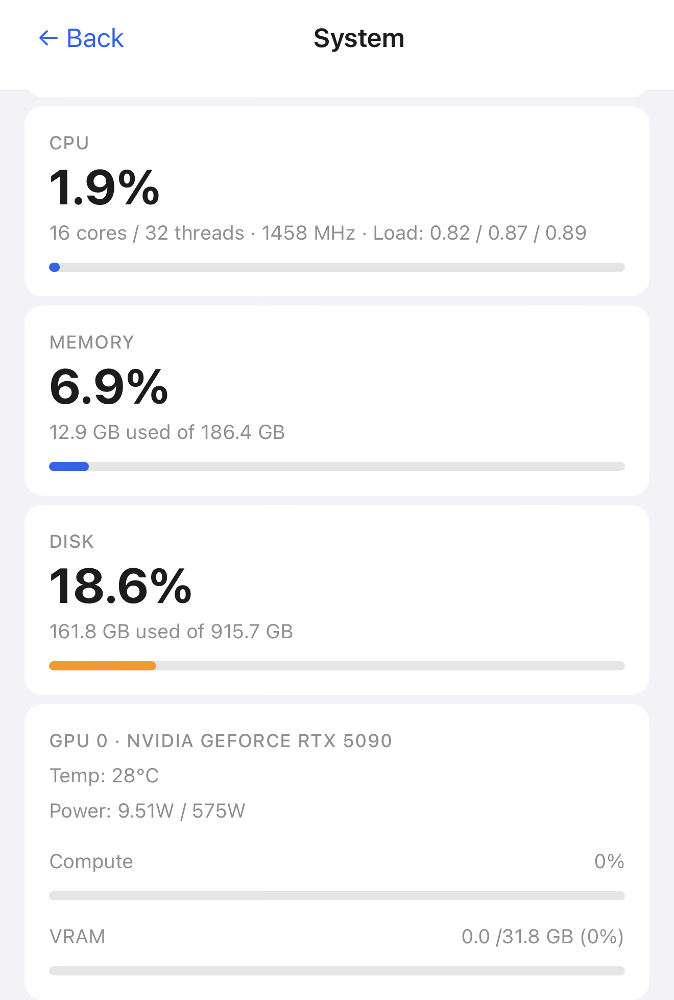
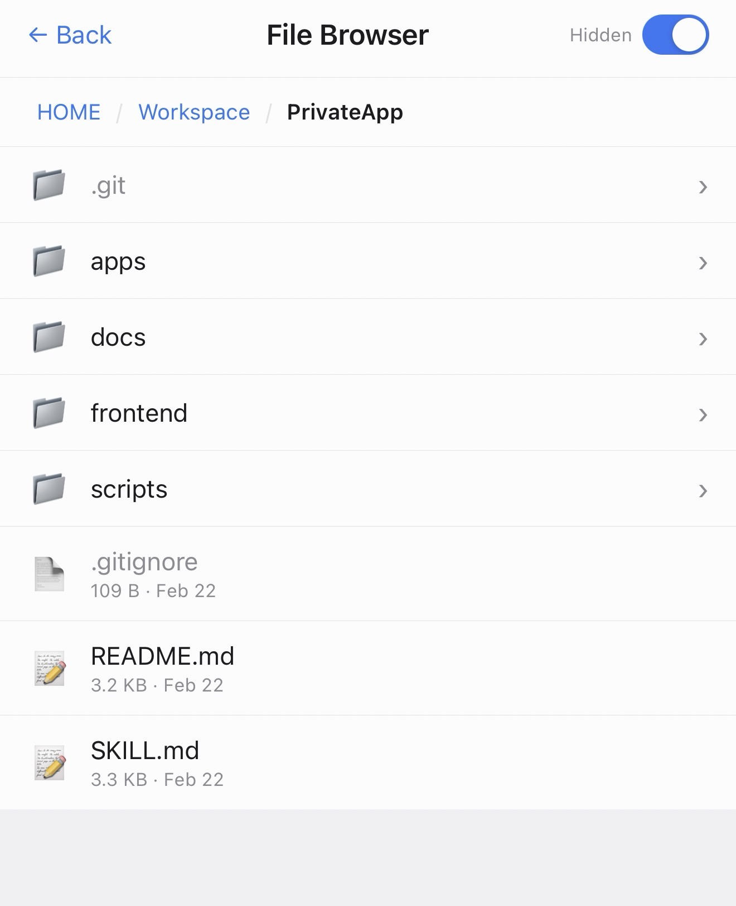
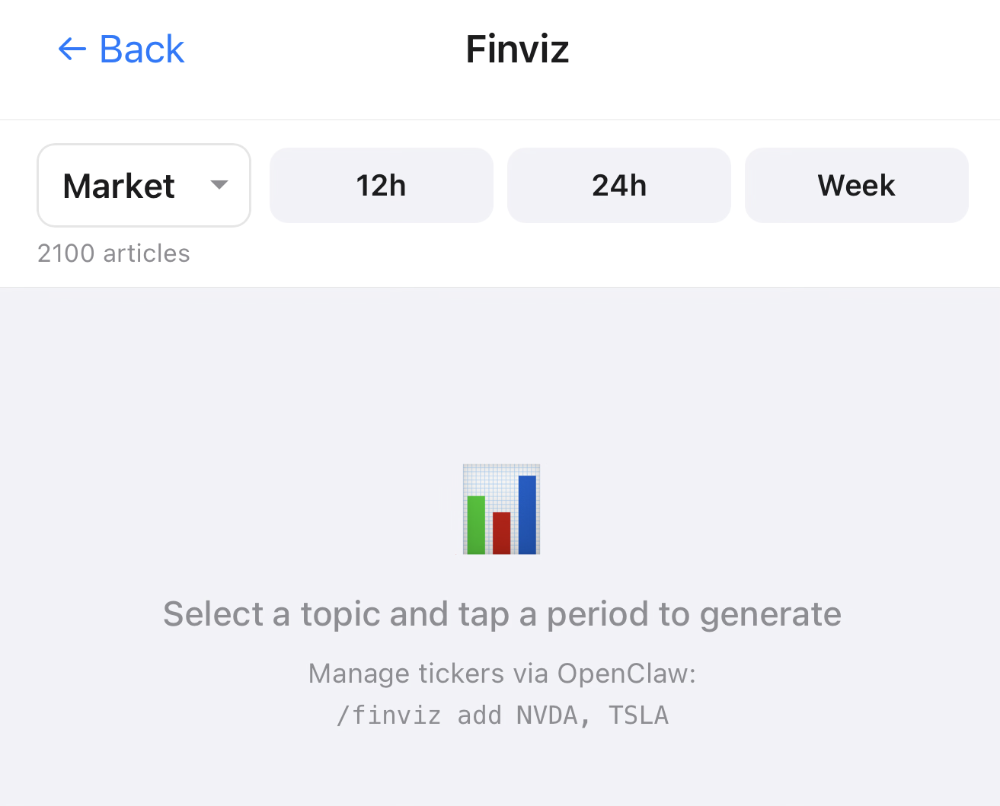
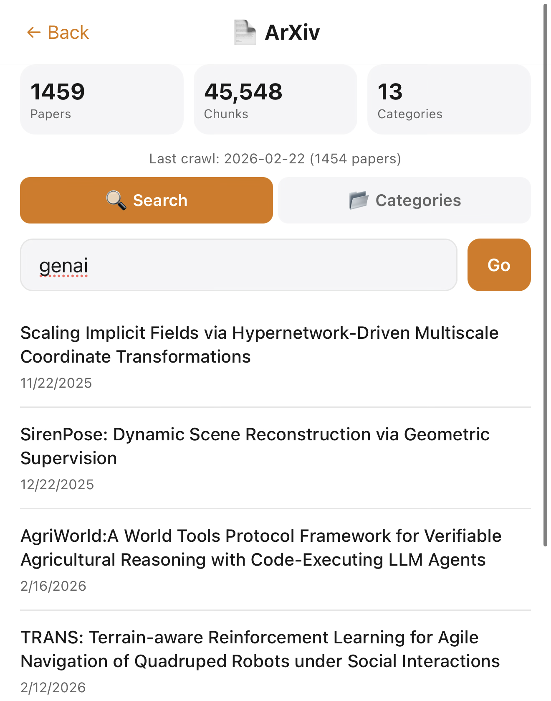

# PrivateApp

**PrivateApp** is a personal PWA dashboard for your home server. Install it on your phone's home screen for a native-like app with financial news, research papers, system monitoring, and file browsing — all served privately over Tailscale VPN.

## Screenshots







## Apps

| App | Description |
|-----|-------------|
| 📊 **System** | Real-time CPU, RAM, disk, GPU stats and service health |
| 📁 **File Browser** | Browse, preview, and share files from your server |
| 📰 **Finviz** | Financial headlines by ticker with LLM summaries (requires [finviz-crawler](https://github.com/camopel/OpenSkill/tree/main/finviz-crawler) skill) |
| 🔬 **ArXiv** | Research paper semantic search with translation (requires [sciencekb](https://github.com/camopel/OpenSkill/tree/main/sciencekb) skill) |

## Requirements

- Python 3.9+
- Node.js 18+ (for building frontend)
- macOS or Linux
- [Tailscale](https://tailscale.com/download) (optional, for remote HTTPS access)

## Install

```bash
git clone https://github.com/camopel/PrivateApp.git
cd PrivateApp
bash scripts/install.sh
```

The install script:
- Creates a Python venv and installs dependencies
- Prompts for VAPID email and generates push notification keys
- Builds the React frontend
- Creates a systemd service (Linux) or launchd plist (macOS)
- Configures Tailscale HTTPS serve (if available)

## Start

```bash
.venv/bin/python3 scripts/server.py
```

Or via system service:
```bash
# Linux
systemctl --user start privateapp

# macOS
launchctl load ~/Library/LaunchAgents/com.privateapp.server.plist
```

Then add to your phone's home screen:
- **iPhone:** Safari → Share → "Add to Home Screen"
- **Android:** Chrome → Menu → "Install app"

## Configuration

Copy `scripts/config.example.json` to `scripts/config.json`:

```json
{
  "host": "0.0.0.0",
  "port": 8800,
  "data_dir": "~/.local/share/privateapp",
  "file_browser": { "root": "~" },
  "push": { "vapid_email": "you@example.com" }
}
```

| Field | Default | Description |
|-------|---------|-------------|
| `port` | `8800` | HTTP port |
| `data_dir` | `~/.local/share/privateapp` | Push subscriptions, settings |
| `file_browser.root` | `~` | Root directory for File Browser |
| `push.vapid_email` | — | Contact email for VAPID push (required) |

## Data

```
~/.local/share/privateapp/
├── privateapp.db          # App settings, preferences, push subscriptions
├── vapid_private.pem      # VAPID signing key
├── vapid_public.pem       # VAPID public key
└── vapid_public.txt       # VAPID public key (URL-safe base64)
```

## Architecture

```
PrivateApp/
├── frontend/           # React + Vite PWA shell
├── apps/               # App plugins
│   ├── system-monitor/ # System stats + services
│   ├── file-browser/   # File browsing + preview
│   ├── finviz-market/  # Financial news
│   └── science-kb/     # ArXiv papers
├── scripts/
│   ├── server.py       # FastAPI entry point
│   ├── app_loader.py   # Plugin discovery + mounting
│   ├── install.sh      # Full installer
│   └── commons/        # Shared utilities (push, DB)
└── static/dist/        # Built frontend assets
```

**Backend:** Python / FastAPI + Uvicorn
**Frontend:** React 18 / TypeScript / Vite
**Data:** SQLite
**Transport:** Tailscale HTTPS

## Development

See **[SKILL.md](SKILL.md)** for the full guide on adding new apps, including backend routes, frontend setup, app.json config, styling conventions, and how the plugin loader works.

```bash
# Backend
.venv/bin/python3 scripts/server.py

# Frontend (hot reload, proxies /api to backend)
cd apps/my-app/frontend && npm install && npm run dev
```

## License

MIT
